<p align="center">
  <h1 align="center">⚡ PROXY HUNTER ALL-IN-ONE ⚡</h1>
  <p align="center">
    <strong>Blazing-Fast Multi-Threaded Proxy Scraper, 2.0s Latency Validator & Real-Time Geolocation Engine</strong>
  </p>
  <p align="center">
    <i>Continuously hunts and secures verified, ultra-low latency proxies worldwide or by country.</i>
  </p>
</p>

<p align="center">
  <a href="https://www.python.org/"></a>
  <a href="LICENSE"></a>
  
  
  
  
  <a href="https://github.com/your-username/proxy-all-in-one/issues"></a>
</p>

<p align="center">
  <a href="#-key-features">Key Features</a> •
  <a href="#-terminal-preview">Terminal Preview</a> •
  <a href="#-architecture">Architecture</a> •
  <a href="#-quick-start">Quick Start</a> •
  <a href="#-cli-reference">CLI Reference</a> •
  <a href="#-benchmarks">Benchmarks</a> •
  <a href="#-python-integration">Python Integration</a> •
  <a href="#-license">License</a>
</p>

---

## 📸 Terminal Preview

```text
========================================================================
     🌐  PROXY HUNTER ALL-IN-ONE (SCRAPER & LIVE CHECKER)  🚀
========================================================================
 • Target Country: GLOBAL (Worldwide)
 • Concurrency   : 100 Worker Threads
 • Timeout Filter: 2.0 Seconds Strict Latency Cutoff
 • Hunter Mode   : Continuous Loop (Secures 100 Working Proxies Before Exit)
========================================================================

[1/4] Gathering candidate proxy pool for [GLOBAL]...
[✓] Total 6,737 candidate proxies assembled across 6 upstream sources.

[2/4] Hunting working proxies (Target: 100 working | Timeout: 2.0s | Threads: 100)...

[✓ LIVE] [1/100]   [TR - Istanbul]         http://107.181.155.86:80    | HTTP   | Ping: 110ms | ISP: YottaSrc
[✓ LIVE] [2/100]   [FR - Lauterbourg]      http://109.199.119.160:80   | HTTP   | Ping: 133ms | ISP: Contabo GmbH
[✓ LIVE] [3/100]   [DE - Frankfurt]        http://103.237.102.191:1111 | HTTP   | Ping: 374ms | ISP: Zenlayer Inc
[✓ LIVE] [4/100]   [US - Los Angeles]      http://107.167.18.122:443   | HTTP   | Ping: 400ms | ISP: Sharktech
[✓ LIVE] [5/100]   [MY - Kuala Lumpur]     http://103.95.34.186:3128   | HTTP   | Ping: 459ms | ISP: TT DOTCOM
...
[✓ LIVE] [100/100] [GB - London]           http://51.89.245.148:8080   | HTTP   | Ping: 215ms | ISP: OVH SAS

========================================================================
[3/4] HUNT COMPLETE: 100/100 FAST PROXIES SECURED & SORTED BY PING!
========================================================================
```

---

## 🌟 Key Features

| Feature | Description |
| :--- | :--- |
| **🎯 Country Targeted or Worldwide** | Hunt exclusively inside one country (`TR`, `US`, `DE`, `GB`, `FR`, `NL`, `JP`, etc.) or gather worldwide mixed proxies. |
| **🔄 Continuous 100x Hunter** | **Never exits prematurely**. Automatically iterates across pools until your target quota (e.g. 100 live fast proxies) is achieved. |
| **⚡ 2.0s Strict Latency Cutoff** | Any proxy failing to connect or respond within **2.0 seconds** is instantly dropped. Only blazing fast nodes qualify. |
| **📍 Real-Time Geolocation & ISP** | Resolves actual exit IP, country, city, province/state, and hosting provider / ISP (e.g. Türk Telekom, DigitalOcean, OVH). |
| **🧵 100x Multi-Threaded Engine** | High-throughput concurrent thread pool that verifies hundreds of proxies simultaneously without overhead. |
| **💾 Multi-Format Export** | Exports ready-to-use lists (`working_proxies.txt`, `working_proxies_ipport.txt`, and structured `working_proxies.json`). |
| **🛡️ Zero Ghost Proxies** | Performs end-to-end handshake validation against live endpoints to eliminate non-functional or dead proxies. |

---

## 🏗️ Architecture

```mermaid
flowchart LR
    subgraph Sources["📡 Multi-Source Scraper (6,700+ Nodes)"]
        S1["ProxyScrape v2/v3"]
        S2["Proxifly Geotagged"]
        S3["Geonode API"]
        S4["Monosans & TheSpeedX"]
        S5["RoosterKid & ClarkeTM"]
    end

    subgraph Core["⚡ Proxy Hunter Core Engine"]
        F["Deduplication & Regex Sanitizer"]
        TP["100x Worker Thread Pool\n(2.0s Strict Timeout)"]
        GEO["Live Geolocation Engine\n(Country / City / ISP / Ping)"]
        CL["Continuous Loop Controller\n(Target: 100x Working)"]
    end

    subgraph Output["📁 Ready-To-Use Exports (output/)"]
        O1["working_proxies.txt\n(Full URLs)"]
        O2["working_proxies_ipport.txt\n(Raw IP:Port)"]
        O3["working_proxies.json\n(Detailed Metadata)"]
    end

    Sources --> F
    F --> TP
    TP --> GEO
    GEO --> CL
    CL -- "Target < 100" --> Sources
    CL -- "Target >= 100 Met" --> Output
```



---

## 🚀 Quick Start

### 1. Clone & Install Dependencies

```bash
# Clone the repository
git clone https://github.com/your-username/proxy-all-in-one.git
cd proxy-all-in-one

# Install lightweight dependencies
pip install -r requirements.txt
```

### 2. Interactive Terminal UI

Run with no arguments to enter the interactive control center:

```bash
python main.py
```
> 💡 **Windows Users:** You can simply double-click **`run.bat`** to start instantly!

```text
Select an operation mode:
  [1] ⚡ Fast Hunter: Collect 100 Working Proxies (2s Timeout, 100 Threads)
  [2] 🌍 Global Worldwide (All Countries)
  [3] 🇹🇷 Turkey (TR) Only
  [4] 🇺🇸 United States (US)
  [5] 🇩🇪 Germany (DE)
  [6] 🇬🇧 United Kingdom (GB)
  [7] 🇫🇷 France (FR)
  [8] 🇳🇱 Netherlands (NL)
  [9] 🌐 Custom Country Code (ISO-2: RU, JP, CA, IT, BR, etc.)
  [0] ❌ Exit
```

---

## ⚙️ CLI Reference

For command line automation, CI/CD, and cron pipelines:

```bash
# Continuous 100x Hunter: 100 threads, 2.0s timeout, collect 100 verified global proxies
python main.py --country GLOBAL --target 100 --timeout 2.0 --threads 100

# Hunt only Turkey (TR) proxies until 50 working nodes are collected
python main.py --country TR --target 50

# Hunt United States (US) HTTP/HTTPS proxies
python main.py --country US --protocol http --target 100

# Ultra-fast check with 1.5s timeout on German (DE) proxies
python main.py --country DE --timeout 1.5 --threads 80
```

### Options & Flags

| Flag | Long Argument | Type | Default | Description |
| :--- | :--- | :--- | :--- | :--- |
| `-c` | `--country` | `str` | `Interactive` | Target 2-letter ISO country code (`TR`, `US`, `DE`...) or `GLOBAL` |
| `-n` | `--target` | `int` | `100` | Target quota of active proxies before stopping |
| `-t` | `--threads` | `int` | `100` | Number of concurrent worker threads |
| `-w` | `--timeout` | `float` | `2.0` | Socket timeout cutoff in seconds |
| `-p` | `--protocol` | `str` | `all` | Filter protocol (`all`, `http`, `socks4`, `socks5`) |

---

## 📊 Benchmarks

| Metric | Basic Sequential Checker | Standard Python Checker | ⚡ **Proxy Hunter All-In-One** |
| :--- | :--- | :--- | :--- |
| **Upstream Pool Size** | ~100 proxies | ~500 proxies | **6,700+ Candidate Proxies** |
| **Concurrency** | 1 (Single-threaded) | 10 Threads | **100 Concurrent Threads** |
| **Timeout Policy** | 10.0s (Sluggish) | 5.0s (Average) | **2.0s (Strict Low-Latency)** |
| **Time to 100 Proxies** | > 15 Minutes | ~ 3 - 5 Minutes | **~ 15 - 25 Seconds** |
| **Geolocation Data** | ❌ None | ❌ None | **✅ Country, City, ISP & Ping** |
| **Continuous Loop** | ❌ Exits early | ❌ Exits early | **✅ Keeps hunting until quota met** |

---

## 📁 Exported File Formats (`output/`)

All harvested proxies are sorted by **lowest latency first**:

### 1. `output/working_proxies.txt` (Standard URLs)
```text
http://107.181.155.86:80
http://109.199.119.160:80
socks4://103.237.102.191:11111
socks5://107.167.18.122:443
```

### 2. `output/working_proxies_ipport.txt` (Raw IP:Port)
```text
107.181.155.86:80
109.199.119.160:80
103.237.102.191:11111
107.167.18.122:443
```

### 3. `output/working_proxies.json` (Full Geolocation Record)
```json
[
  {
    "proxy": "http://107.181.155.86:80",
    "ip": "107.181.155.86",
    "port": 80,
    "protocol": "http",
    "latency_ms": 110,
    "country": "Türkiye",
    "country_code": "TR",
    "city": "Istanbul",
    "region": "Istanbul",
    "isp": "YottaSrc",
    "real_ip": "107.181.155.86",
    "working": true,
    "checked_at": "2026-09-21 20:41:22"
  }
]
```

---

## 💻 Python Integration Examples

### Example 1: Standard `requests` with Auto-Rotation
```python
import random
import requests

# Load all verified working proxies
with open("output/working_proxies.txt", "r") as f:
    proxies = [line.strip() for line in f if line.strip()]

# Pick random or fastest proxy
selected_proxy = random.choice(proxies)
print(f"Routing through: {selected_proxy}")

response = requests.get(
    "http://ip-api.com/json",
    proxies={"http": selected_proxy, "https": selected_proxy},
    timeout=5
)
data = response.json()
print(f"Verified Exit: {data['country']} ({data['city']}) - IP: {data['query']}")
```

### Example 2: Run Built-In Integration Tester
```bash
python example_usage.py
```

---

## 🤝 Contributing

Contributions, feature requests, and bug reports are welcome!

1. Fork the Project
2. Create your Feature Branch (`git checkout -b feature/NewFeature`)
3. Commit your Changes (`git commit -m 'Add some NewFeature'`)
4. Push to the Branch (`git push origin feature/NewFeature`)
5. Open a Pull Request

---

## 📄 License

This project is licensed under the **MIT License** - see the [LICENSE](LICENSE) file for details.

<p align="center">
  Made with ❤️ for high-performance web automation & privacy research.
  <br />
  <strong>⭐ If this tool helped you, please give it a Star on GitHub! ⭐</strong>
</p>
